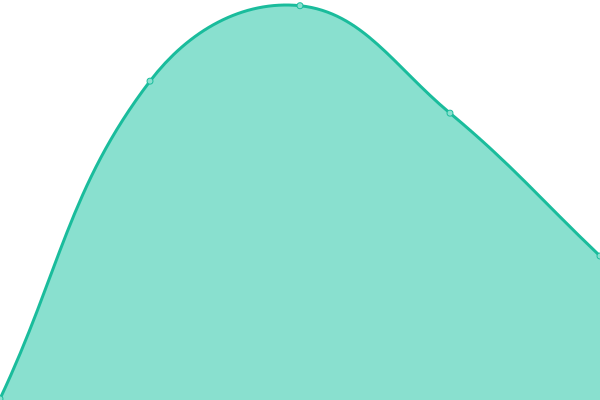
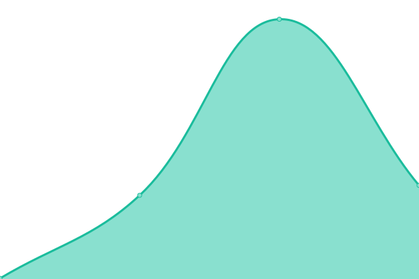
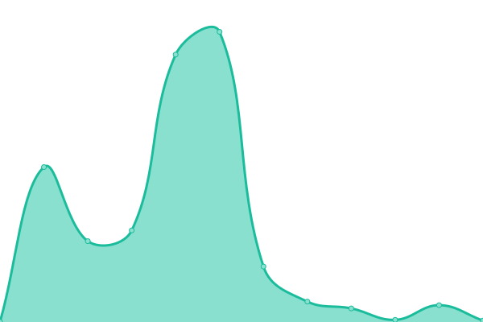
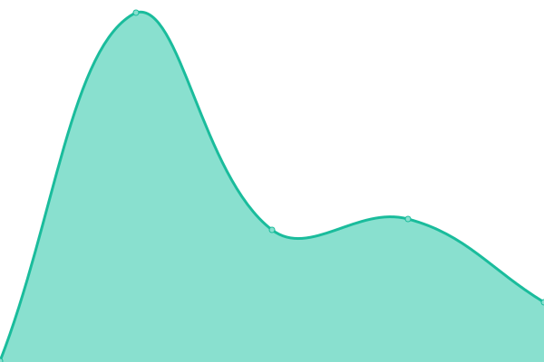
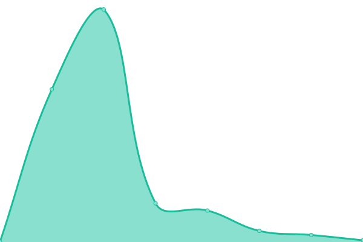
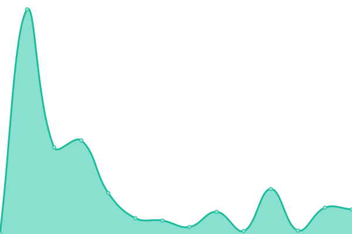
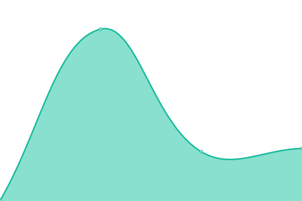
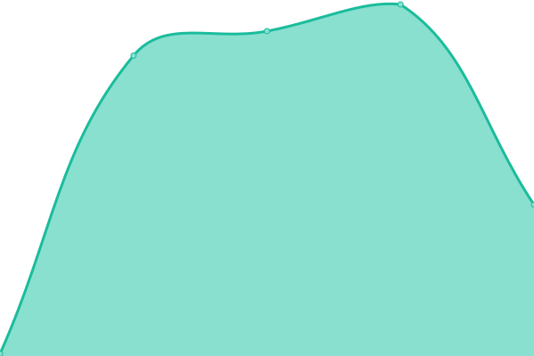

# [📈 Live Status](https://demo.upptime.js.org): <!--live status--> **🟧 Partial outage**

This repository contains the open-source uptime monitor and status page for [Upptime](https://upptime.js.org), powered by [Upptime](https://github.com/upptime/upptime).

With [Upptime](https://upptime.js.org), you can get your own unlimited and free uptime monitor and status page, powered entirely by a GitHub repository. We use [Issues](https://github.com/upptime/upptime/issues) as incident reports, [Actions](https://github.com/goquantio/crypto-monitor/actions) as uptime monitors, and [Pages](https://demo.upptime.js.org) for the status page.

<!--start: status pages-->
<!-- This summary is generated by Upptime (https://github.com/upptime/upptime) -->
<!-- Do not edit this manually, your changes will be overwritten -->
<!-- prettier-ignore -->
| URL | Status | History | Response Time | Uptime |
| --- | ------ | ------- | ------------- | ------ |
|  [Binance - aggTrades](https://data.binance.com/api/v3/aggTrades) | 🟥 Down | [binance-agg-trades.yml](https://github.com/goquantio/crypto-monitor/commits/HEAD/history/binance-agg-trades.yml) | 

 279ms
     
 | 

<a href="https://goquantio.github.io/crypto-monitor/history/binance-agg-trades">3.60%</a>
    

|  [Binance - avgPrice](https://data.binance.com/api/v3/avgPrice) | 🟥 Down | [binance-avg-price.yml](https://github.com/goquantio/crypto-monitor/commits/HEAD/history/binance-avg-price.yml) | 

 135ms
     
 | 

<a href="https://goquantio.github.io/crypto-monitor/history/binance-avg-price">1.92%</a>
    

|  [Binance - depth](https://data.binance.com/api/v3/depth) | 🟥 Down | [binance-depth.yml](https://github.com/goquantio/crypto-monitor/commits/HEAD/history/binance-depth.yml) | 

 138ms
     
 | 

<a href="https://goquantio.github.io/crypto-monitor/history/binance-depth">3.95%</a>
    

|  [Binance - exchangeInfo](https://data.binance.com/api/v3/exchangeInfo) | 🟩 Up | [binance-exchange-info.yml](https://github.com/goquantio/crypto-monitor/commits/HEAD/history/binance-exchange-info.yml) | 

 610ms
     
 | 

<a href="https://goquantio.github.io/crypto-monitor/history/binance-exchange-info">100.00%</a>
    

|  [Binance - klines](https://data.binance.com/api/v3/klines) | 🟥 Down | [binance-klines.yml](https://github.com/goquantio/crypto-monitor/commits/HEAD/history/binance-klines.yml) | 

 137ms
     
 | 

<a href="https://goquantio.github.io/crypto-monitor/history/binance-klines">3.68%</a>
    

|  [Binance - ping](https://data.binance.com/api/v3/ping) | 🟩 Up | [binance-ping.yml](https://github.com/goquantio/crypto-monitor/commits/HEAD/history/binance-ping.yml) | 

 386ms
     
 | 

<a href="https://goquantio.github.io/crypto-monitor/history/binance-ping">100.00%</a>
    

|  [Binance - ticker](https://data.binance.com/api/v3/ticker) | 🟥 Down | [binance-ticker.yml](https://github.com/goquantio/crypto-monitor/commits/HEAD/history/binance-ticker.yml) | 

 139ms
     
 | 

<a href="https://goquantio.github.io/crypto-monitor/history/binance-ticker">8.72%</a>
    

|  [Binance - ticker/24hr](https://data.binance.com/api/v3/ticker/24hr) | 🟩 Up | [binance-ticker-24hr.yml](https://github.com/goquantio/crypto-monitor/commits/HEAD/history/binance-ticker-24hr.yml) | 

 631ms
     
 | 

<a href="https://goquantio.github.io/crypto-monitor/history/binance-ticker-24hr">100.00%</a>
    

|  [Binance - ticker/bookTicker](https://data.binance.com/api/v3/ticker/bookTicker) | 🟩 Up | [binance-ticker-book-ticker.yml](https://github.com/goquantio/crypto-monitor/commits/HEAD/history/binance-ticker-book-ticker.yml) | 

 384ms
     
 | 

<a href="https://goquantio.github.io/crypto-monitor/history/binance-ticker-book-ticker">100.00%</a>
    

|  [Binance - ticker/price](https://data.binance.com/api/v3/ticker/price) | 🟩 Up | [binance-ticker-price.yml](https://github.com/goquantio/crypto-monitor/commits/HEAD/history/binance-ticker-price.yml) | 

 134ms
     
 | 

<a href="https://goquantio.github.io/crypto-monitor/history/binance-ticker-price">100.00%</a>
    

|  [Binance - time](https://data.binance.com/api/v3/time) | 🟩 Up | [binance-time.yml](https://github.com/goquantio/crypto-monitor/commits/HEAD/history/binance-time.yml) | 

 134ms
     
 | 

<a href="https://goquantio.github.io/crypto-monitor/history/binance-time">100.00%</a>
    

|  [Binance - trades](https://data.binance.com/api/v3/trades) | 🟥 Down | [binance-trades.yml](https://github.com/goquantio/crypto-monitor/commits/HEAD/history/binance-trades.yml) | 

 513ms
     
 | 

<a href="https://goquantio.github.io/crypto-monitor/history/binance-trades">10.33%</a>
    

|  [Binance - uiKlines](https://data.binance.com/api/v3/uiKlines) | 🟥 Down | [binance-ui-klines.yml](https://github.com/goquantio/crypto-monitor/commits/HEAD/history/binance-ui-klines.yml) | 

 135ms
     
 | 

<a href="https://goquantio.github.io/crypto-monitor/history/binance-ui-klines">7.99%</a>
    

<!--end: status pages-->

[**Visit our status website →**](https://demo.upptime.js.org)

## 📄 License

- Powered by: [Upptime](https://github.com/upptime/upptime)
- Code: [MIT](./LICENSE) © [Upptime](https://upptime.js.org)
- Data in the `./history` directory: [Open Database License](https://opendatacommons.org/licenses/odbl/1-0/)
