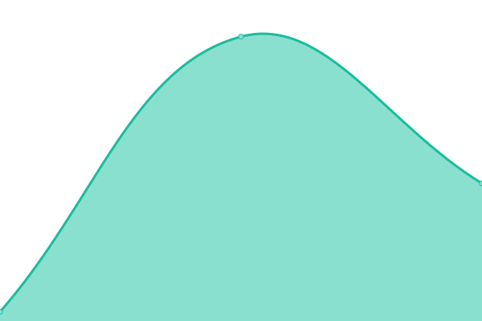

# [📈 Live Status](https://demo.upptime.js.org): <!--live status--> **🟧 Partial outage**

This repository contains the open-source uptime monitor and status page for [Upptime](https://upptime.js.org), powered by [Upptime](https://github.com/upptime/upptime).

With [Upptime](https://upptime.js.org), you can get your own unlimited and free uptime monitor and status page, powered entirely by a GitHub repository. We use [Issues](https://github.com/upptime/upptime/issues) as incident reports, [Actions](https://github.com/goquantio/crypto-monitor/actions) as uptime monitors, and [Pages](https://demo.upptime.js.org) for the status page.

<!--start: status pages-->
<!-- This summary is generated by Upptime (https://github.com/upptime/upptime) -->
<!-- Do not edit this manually, your changes will be overwritten -->
<!-- prettier-ignore -->
| URL | Status | History | Response Time | Uptime |
| --- | ------ | ------- | ------------- | ------ |
|  [Binance - ping](https://api.binance.us/api/v3/ping) | 🟩 Up | [binance-ping.yml](https://github.com/goquantio/crypto-monitor/commits/HEAD/history/binance-ping.yml) | 

 123ms
     
 | 

<a href="https://goquantio.github.io/crypto-monitor/history/binance-ping">100.00%</a>
    

|  [Binance - time](https://api.binance.us/fapi/v1/time) | 🟩 Up | [binance-time.yml](https://github.com/goquantio/crypto-monitor/commits/HEAD/history/binance-time.yml) | 

 70ms
     
 | 

<a href="https://goquantio.github.io/crypto-monitor/history/binance-time">99.90%</a>
    

|  [Binance - aggTrades](https://api.binance.us/api/v3/aggTrades) | 🟥 Down | [binance-agg-trades.yml](https://github.com/goquantio/crypto-monitor/commits/HEAD/history/binance-agg-trades.yml) | 

 176ms
     
 | 

<a href="https://goquantio.github.io/crypto-monitor/history/binance-agg-trades">0.01%</a>
    

|  [Binance - avgPrice - BTCUSDT](https://api.binance.us/api/v3/avgPrice?symbol=BTCUSDT) | 🟩 Up | [binance-avg-price-btcusdt.yml](https://github.com/goquantio/crypto-monitor/commits/HEAD/history/binance-avg-price-btcusdt.yml) | 

 14ms
     
 | 

<a href="https://goquantio.github.io/crypto-monitor/history/binance-avg-price-btcusdt">100.00%</a>
    

|  [Binance - depth - BTCUSDT](https://api.binance.us/api/v3/depth?symbol=BTCUSDT) | 🟩 Up | [binance-depth-btcusdt.yml](https://github.com/goquantio/crypto-monitor/commits/HEAD/history/binance-depth-btcusdt.yml) | 

 14ms
     
 | 

<a href="https://goquantio.github.io/crypto-monitor/history/binance-depth-btcusdt">100.00%</a>
    

|  [Binance - exchangeInfo](https://api.binance.us/api/v3/exchangeInfo) | 🟩 Up | [binance-exchange-info.yml](https://github.com/goquantio/crypto-monitor/commits/HEAD/history/binance-exchange-info.yml) | 

 607ms
     
 | 

<a href="https://goquantio.github.io/crypto-monitor/history/binance-exchange-info">100.00%</a>
    

|  [Binance - klines - BTCUSDT - 1 day](https://api.binance.us/api/v3/klines?symbol=BTCUSDT&interval=1d) | 🟩 Up | [binance-klines-btcusdt-1-day.yml](https://github.com/goquantio/crypto-monitor/commits/HEAD/history/binance-klines-btcusdt-1-day.yml) | 

 23ms
     
 | 

<a href="https://goquantio.github.io/crypto-monitor/history/binance-klines-btcusdt-1-day">100.00%</a>
    

|  [Binance - ticker - BTCUSDT](https://api.binance.us/api/v3/ticker?symbol=BTCUSDT) | 🟩 Up | [binance-ticker-btcusdt.yml](https://github.com/goquantio/crypto-monitor/commits/HEAD/history/binance-ticker-btcusdt.yml) | 

 16ms
     
 | 

<a href="https://goquantio.github.io/crypto-monitor/history/binance-ticker-btcusdt">100.00%</a>
    

|  [Binance - ticker/24hr](https://api.binance.us/api/v3/ticker/24hr) | 🟩 Up | [binance-ticker-24hr.yml](https://github.com/goquantio/crypto-monitor/commits/HEAD/history/binance-ticker-24hr.yml) | 

 281ms
     
 | 

<a href="https://goquantio.github.io/crypto-monitor/history/binance-ticker-24hr">100.00%</a>
    

|  [Binance - ticker/bookTicker](https://api.binance.us/api/v3/ticker/bookTicker) | 🟩 Up | [binance-ticker-book-ticker.yml](https://github.com/goquantio/crypto-monitor/commits/HEAD/history/binance-ticker-book-ticker.yml) | 

 118ms
     
 | 

<a href="https://goquantio.github.io/crypto-monitor/history/binance-ticker-book-ticker">100.00%</a>
    

|  [Binance - ticker/price](https://api.binance.us/api/v3/ticker/price) | 🟩 Up | [binance-ticker-price.yml](https://github.com/goquantio/crypto-monitor/commits/HEAD/history/binance-ticker-price.yml) | 

 80ms
     
 | 

<a href="https://goquantio.github.io/crypto-monitor/history/binance-ticker-price">100.00%</a>
    

|  [Binance - time](https://api.binance.us/api/v3/time) | 🟩 Up | [binance-time.yml](https://github.com/goquantio/crypto-monitor/commits/HEAD/history/binance-time.yml) | 

 70ms
     
 | 

<a href="https://goquantio.github.io/crypto-monitor/history/binance-time">99.90%</a>
    

|  [Binance - trades - BTCUSDT](https://api.binance.us/api/v3/trades?symbol=BTCUSDT) | 🟩 Up | [binance-trades-btcusdt.yml](https://github.com/goquantio/crypto-monitor/commits/HEAD/history/binance-trades-btcusdt.yml) | 

 15ms
     
 | 

<a href="https://goquantio.github.io/crypto-monitor/history/binance-trades-btcusdt">100.00%</a>
    

|  [Binance - historical trades - BTCUSDT/limit=500](https://api.binance.us/api/v3/ticker/24hr) | 🟩 Up | [binance-historical-trades-btcusdt-limit-500.yml](https://github.com/goquantio/crypto-monitor/commits/HEAD/history/binance-historical-trades-btcusdt-limit-500.yml) | 

 6ms
     
 | 

<a href="https://goquantio.github.io/crypto-monitor/history/binance-historical-trades-btcusdt-limit-500">100.00%</a>
    

|  [Binance - futures ping](https://api.binance.us/fapi/v1/ping) | 🟥 Down | [binance-futures-ping.yml](https://github.com/goquantio/crypto-monitor/commits/HEAD/history/binance-futures-ping.yml) | 

 4ms
     
 | 

<a href="https://goquantio.github.io/crypto-monitor/history/binance-futures-ping">6.75%</a>
    

|  [Binance - futures server time](https://api.binance.us/fapi/v1/time) | 🟥 Down | [binance-futures-server-time.yml](https://github.com/goquantio/crypto-monitor/commits/HEAD/history/binance-futures-server-time.yml) | 

 4ms
     
 | 

<a href="https://goquantio.github.io/crypto-monitor/history/binance-futures-server-time">0.00%</a>
    

<!--end: status pages-->

[**Visit our status website →**](https://demo.upptime.js.org)

## 📄 License

- Powered by: [Upptime](https://github.com/upptime/upptime)
- Code: [MIT](./LICENSE) © [Upptime](https://upptime.js.org)
- Data in the `./history` directory: [Open Database License](https://opendatacommons.org/licenses/odbl/1-0/)
