# [📈 Live Status](https://demo.upptime.js.org): <!--live status--> **🟩 All systems operational**

This repository contains the open-source uptime monitor and status page for [Upptime](https://upptime.js.org), powered by [Upptime](https://github.com/upptime/upptime).

With [Upptime](https://upptime.js.org), you can get your own unlimited and free uptime monitor and status page, powered entirely by a GitHub repository. We use [Issues](https://github.com/upptime/upptime/issues) as incident reports, [Actions](https://github.com/goquantio/crypto-monitor/actions) as uptime monitors, and [Pages](https://demo.upptime.js.org) for the status page.

<!--start: status pages-->
<!-- This summary is generated by Upptime (https://github.com/upptime/upptime) -->
<!-- Do not edit this manually, your changes will be overwritten -->
<!-- prettier-ignore -->
| URL | Status | History | Response Time | Uptime |
| --- | ------ | ------- | ------------- | ------ |
|  [Server Time](https://api.binance.us/api/v3/time) | 🟩 Up | [server-time.yml](https://github.com/goquantio/crypto-monitor/commits/HEAD/history/server-time.yml) | 

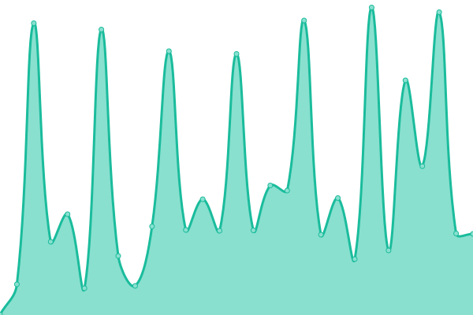 489ms
     
 | 

<a href="https://goquantio.github.io/crypto-monitor/history/server-time">99.49%</a>
    

|  [Server Time](https://api-testnet.bybit.com/v2/public/time) | 🟩 Up | [server-time.yml](https://github.com/goquantio/crypto-monitor/commits/HEAD/history/server-time.yml) | 

 489ms
     
 | 

<a href="https://goquantio.github.io/crypto-monitor/history/server-time">99.49%</a>
    

|  [Server Time](https://api.kraken.com/0/public/Time) | 🟩 Up | [server-time.yml](https://github.com/goquantio/crypto-monitor/commits/HEAD/history/server-time.yml) | 

 489ms
     
 | 

<a href="https://goquantio.github.io/crypto-monitor/history/server-time">99.49%</a>
    

|  [Server Time](https://api-pub.bitfinex.com/v2/platform/status) | 🟩 Up | [server-time.yml](https://github.com/goquantio/crypto-monitor/commits/HEAD/history/server-time.yml) | 

 489ms
     
 | 

<a href="https://goquantio.github.io/crypto-monitor/history/server-time">99.49%</a>
    

|  [Orderbook (BTCUSDT)](https://api.binance.us/api/v3/depth?symbol=BTCUSDT) | 🟩 Up | [orderbook-btcusdt.yml](https://github.com/goquantio/crypto-monitor/commits/HEAD/history/orderbook-btcusdt.yml) | 

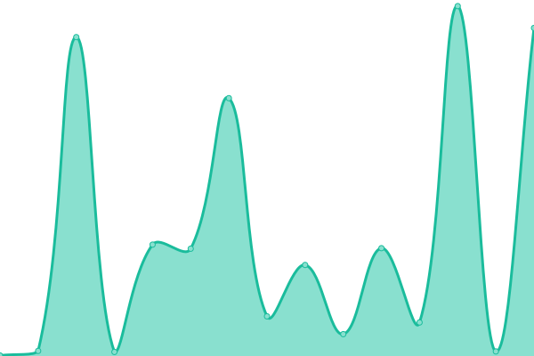 269ms
     
 | 

<a href="https://goquantio.github.io/crypto-monitor/history/orderbook-btcusdt">100.00%</a>
    

|  [Orderbook (BTCUSDT)](https://api-testnet.bybit.com/public/linear/kline?symbol=BTCUSDT&interval=1&limit=2&from=1581231260) | 🟩 Up | [orderbook-btcusdt.yml](https://github.com/goquantio/crypto-monitor/commits/HEAD/history/orderbook-btcusdt.yml) | 

 269ms
     
 | 

<a href="https://goquantio.github.io/crypto-monitor/history/orderbook-btcusdt">100.00%</a>
    

|  [Orderbook (XBTUSD)](https://api.kraken.com/0/public/Depth?pair=XBTUSD) | 🟩 Up | [orderbook-xbtusd.yml](https://github.com/goquantio/crypto-monitor/commits/HEAD/history/orderbook-xbtusd.yml) | 

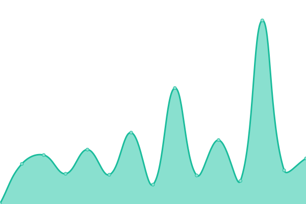 133ms
     
 | 

<a href="https://goquantio.github.io/crypto-monitor/history/orderbook-xbtusd">99.49%</a>
    

|  [Orderbook (XBTUSD)](https://api-pub.bitfinex.com/v2/book/tBTCUSD/P0?len=25) | 🟩 Up | [orderbook-xbtusd.yml](https://github.com/goquantio/crypto-monitor/commits/HEAD/history/orderbook-xbtusd.yml) | 

 133ms
     
 | 

<a href="https://goquantio.github.io/crypto-monitor/history/orderbook-xbtusd">99.49%</a>
    

|  [OHLCV (BTCUSDT/1 Day Interval)](https://api.binance.us/api/v3/klines?symbol=BTCUSDT&interval=1d) | 🟩 Up | [ohlcv-btcusdt-1-day-interval.yml](https://github.com/goquantio/crypto-monitor/commits/HEAD/history/ohlcv-btcusdt-1-day-interval.yml) | 

 97ms
     
 | 

<a href="https://goquantio.github.io/crypto-monitor/history/ohlcv-btcusdt-1-day-interval">100.00%</a>
    

|  [OHLCV (BTCUSDT/1 Day Interval/Limit = 2)](https://api-testnet.bybit.com/public/linear/kline?symbol=BTCUSDT&interval=1&limit=2&from=1581231260) | 🟩 Up | [ohlcv-btcusdt-1-day-interval-limit-2.yml](https://github.com/goquantio/crypto-monitor/commits/HEAD/history/ohlcv-btcusdt-1-day-interval-limit-2.yml) | 

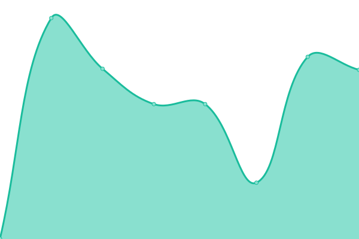 594ms
     
 | 

<a href="https://goquantio.github.io/crypto-monitor/history/ohlcv-btcusdt-1-day-interval-limit-2">100.00%</a>
    

|  [OHLCV (XBTUSD)](https://api.kraken.com/0/public/OHLC?pair=XBTUSD) | 🟩 Up | [ohlcv-xbtusd.yml](https://github.com/goquantio/crypto-monitor/commits/HEAD/history/ohlcv-xbtusd.yml) | 

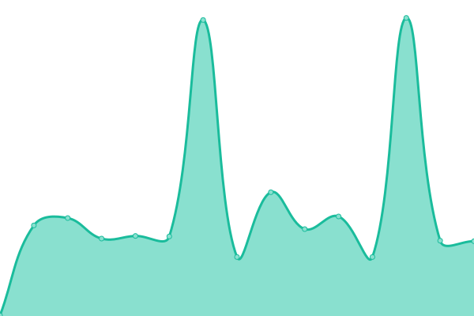 169ms
     
 | 

<a href="https://goquantio.github.io/crypto-monitor/history/ohlcv-xbtusd">99.49%</a>
    

|  [OHLCV (XBTUSD)](https://api-pub.bitfinex.com/v2/candles/trade:1m:tBTCUSD/hist?limit=120&sort=-1) | 🟩 Up | [ohlcv-xbtusd.yml](https://github.com/goquantio/crypto-monitor/commits/HEAD/history/ohlcv-xbtusd.yml) | 

 169ms
     
 | 

<a href="https://goquantio.github.io/crypto-monitor/history/ohlcv-xbtusd">99.49%</a>
    

|  [Symbol Pairs (BTCUSDT)](https://api.binance.us/api/v3/ticker?symbol=BTCUSDT) | 🟩 Up | [symbol-pairs-btcusdt.yml](https://github.com/goquantio/crypto-monitor/commits/HEAD/history/symbol-pairs-btcusdt.yml) | 

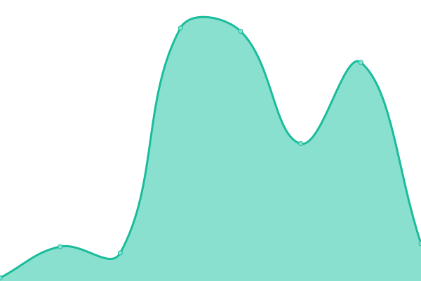 34ms
     
 | 

<a href="https://goquantio.github.io/crypto-monitor/history/symbol-pairs-btcusdt">100.00%</a>
    

|  [Symbol Pairs (BTCUSDT/Limit = 500)](https://api-testnet.bybit.com/public/linear/recent-trading-records?symbol=BTCUSDT&limit=500) | 🟩 Up | [symbol-pairs-btcusdt-limit-500.yml](https://github.com/goquantio/crypto-monitor/commits/HEAD/history/symbol-pairs-btcusdt-limit-500.yml) | 

 905ms
     
 | 

<a href="https://goquantio.github.io/crypto-monitor/history/symbol-pairs-btcusdt-limit-500">100.00%</a>
    

|  [Symbol Pairs (XBT/ETH)](https://api.kraken.com/0/public/AssetPairs?pair=XXBTZUSD,XETHXXBT) | 🟩 Up | [symbol-pairs-xbt-eth.yml](https://github.com/goquantio/crypto-monitor/commits/HEAD/history/symbol-pairs-xbt-eth.yml) | 

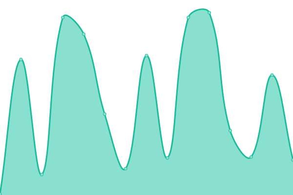 155ms
     
 | 

<a href="https://goquantio.github.io/crypto-monitor/history/symbol-pairs-xbt-eth">99.49%</a>
    

|  [Symbol Pairs (XBT/ETH)](https://api-pub.bitfinex.com/v2/ticker/tBTCUSD) | 🟩 Up | [symbol-pairs-xbt-eth.yml](https://github.com/goquantio/crypto-monitor/commits/HEAD/history/symbol-pairs-xbt-eth.yml) | 

 155ms
     
 | 

<a href="https://goquantio.github.io/crypto-monitor/history/symbol-pairs-xbt-eth">99.49%</a>
    

|  [Recent Trading - (BTCUSDT)](https://api.binance.us/api/v3/trades?symbol=BTCUSDT) | 🟩 Up | [recent-trading-btcusdt.yml](https://github.com/goquantio/crypto-monitor/commits/HEAD/history/recent-trading-btcusdt.yml) | 

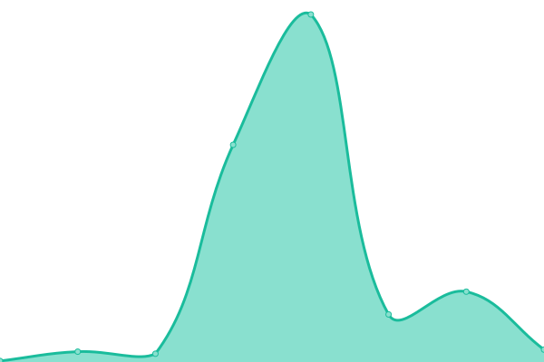 53ms
     
 | 

<a href="https://goquantio.github.io/crypto-monitor/history/recent-trading-btcusdt">100.00%</a>
    

|  [Recent Trading - (BTCUSDT/Limit = 500)](https://api-testnet.bybit.com/public/linear/recent-trading-records?symbol=BTCUSDT&limit=500) | 🟩 Up | [recent-trading-btcusdt-limit-500.yml](https://github.com/goquantio/crypto-monitor/commits/HEAD/history/recent-trading-btcusdt-limit-500.yml) | 

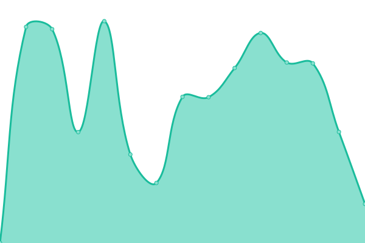 945ms
     
 | 

<a href="https://goquantio.github.io/crypto-monitor/history/recent-trading-btcusdt-limit-500">100.00%</a>
    

|  [Recent Trading - (XBTUSD)](https://api.kraken.com/0/public/Trades?pair=XBTUSD) | 🟩 Up | [recent-trading-xbtusd.yml](https://github.com/goquantio/crypto-monitor/commits/HEAD/history/recent-trading-xbtusd.yml) | 

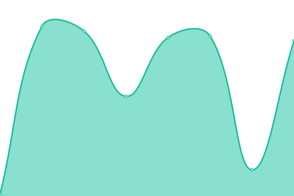 85ms
     
 | 

<a href="https://goquantio.github.io/crypto-monitor/history/recent-trading-xbtusd">100.00%</a>
    

|  [Aggregate Trades (BTCUSDT/limit=500)](https://api.binance.us/api/v3/aggTrades?symbol=BTCUSDT&limit=500) | 🟩 Up | [aggregate-trades-btcusdt-limit-500.yml](https://github.com/goquantio/crypto-monitor/commits/HEAD/history/aggregate-trades-btcusdt-limit-500.yml) | 

 55ms
     
 | 

<a href="https://goquantio.github.io/crypto-monitor/history/aggregate-trades-btcusdt-limit-500">100.00%</a>
    

|  [Average Price - (BTCUSDT)](https://api.binance.us/api/v3/avgPrice?symbol=BTCUSDT) | 🟩 Up | [average-price-btcusdt.yml](https://github.com/goquantio/crypto-monitor/commits/HEAD/history/average-price-btcusdt.yml) | 

 34ms
     
 | 

<a href="https://goquantio.github.io/crypto-monitor/history/average-price-btcusdt">100.00%</a>
    

|  [exchangeInfo](https://api.binance.us/api/v3/exchangeInfo) | 🟩 Up | [exchange-info.yml](https://github.com/goquantio/crypto-monitor/commits/HEAD/history/exchange-info.yml) | 

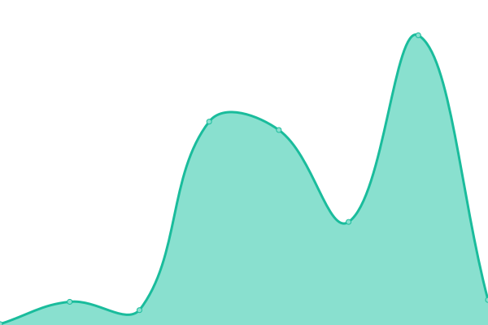 245ms
     
 | 

<a href="https://goquantio.github.io/crypto-monitor/history/exchange-info">100.00%</a>
    

|  [Ping](https://api.binance.us/api/v3/ping) | 🟩 Up | [ping.yml](https://github.com/goquantio/crypto-monitor/commits/HEAD/history/ping.yml) | 

 32ms
     
 | 

<a href="https://goquantio.github.io/crypto-monitor/history/ping">100.00%</a>
    

|  [UIKlines (BTCUSDT/1 Day Interval/Limit = 500)](https://api.binance.us/api/v3/uiKlines?symbol=BTCUSDT&interval=1d&limit=500) | 🟩 Up | [ui-klines-btcusdt-1-day-interval-limit-500.yml](https://github.com/goquantio/crypto-monitor/commits/HEAD/history/ui-klines-btcusdt-1-day-interval-limit-500.yml) | 

 58ms
     
 | 

<a href="https://goquantio.github.io/crypto-monitor/history/ui-klines-btcusdt-1-day-interval-limit-500">100.00%</a>
    

|  [Ticker/24hr](https://api.binance.us/api/v3/ticker/24hr) | 🟩 Up | [ticker-24hr.yml](https://github.com/goquantio/crypto-monitor/commits/HEAD/history/ticker-24hr.yml) | 

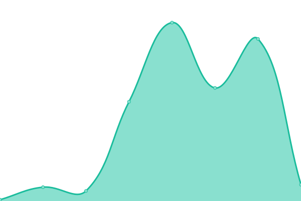 100ms
     
 | 

<a href="https://goquantio.github.io/crypto-monitor/history/ticker-24hr">100.00%</a>
    

|  [Ticker/Book Ticker](https://api.binance.us/api/v3/ticker/bookTicker) | 🟩 Up | [ticker-book-ticker.yml](https://github.com/goquantio/crypto-monitor/commits/HEAD/history/ticker-book-ticker.yml) | 

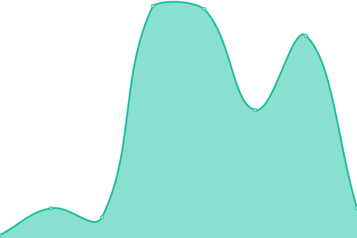 33ms
     
 | 

<a href="https://goquantio.github.io/crypto-monitor/history/ticker-book-ticker">100.00%</a>
    

|  [Ticker/Price](https://api.binance.us/api/v3/ticker/price) | 🟩 Up | [ticker-price.yml](https://github.com/goquantio/crypto-monitor/commits/HEAD/history/ticker-price.yml) | 

 32ms
     
 | 

<a href="https://goquantio.github.io/crypto-monitor/history/ticker-price">100.00%</a>
    

|  [Kline - (BTCUSDT/Interval 1/From Now)](https://api-testnet.bybit.com/public/linear/kline?symbol=BTCUSDT&interval=1&limit=2&from=1581231260) | 🟩 Up | [kline-btcusdt-interval-1-from-now.yml](https://github.com/goquantio/crypto-monitor/commits/HEAD/history/kline-btcusdt-interval-1-from-now.yml) | 

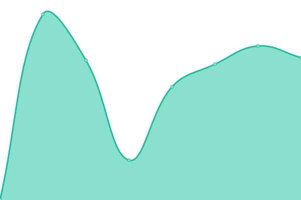 557ms
     
 | 

<a href="https://goquantio.github.io/crypto-monitor/history/kline-btcusdt-interval-1-from-now">100.00%</a>
    

|  [Recent Trading - (BTCUSDT/Limit = 500)](https://api-testnet.bybit.com/public/linear/recent-trading-records?symbol=BTCUSDT&limit=500) | 🟩 Up | [recent-trading-btcusdt-limit-500.yml](https://github.com/goquantio/crypto-monitor/commits/HEAD/history/recent-trading-btcusdt-limit-500.yml) | 

 945ms
     
 | 

<a href="https://goquantio.github.io/crypto-monitor/history/recent-trading-btcusdt-limit-500">100.00%</a>
    

|  [Latest Funding Rate - (BTCUSDT/Limit = 500)](https://api-testnet.bybit.com/public/linear/funding/prev-funding-rate?symbol=BTCUSDT) | 🟩 Up | [latest-funding-rate-btcusdt-limit-500.yml](https://github.com/goquantio/crypto-monitor/commits/HEAD/history/latest-funding-rate-btcusdt-limit-500.yml) | 

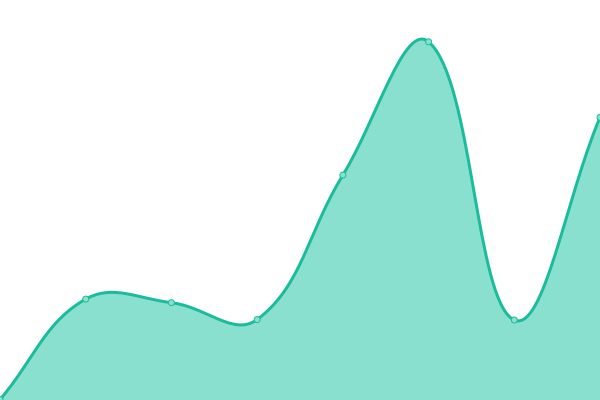 567ms
     
 | 

<a href="https://goquantio.github.io/crypto-monitor/history/latest-funding-rate-btcusdt-limit-500">100.00%</a>
    

<!--end: status pages-->

[**Visit our status website →**](https://demo.upptime.js.org)

## 📄 License

- Powered by: [Upptime](https://github.com/upptime/upptime)
- Code: [MIT](./LICENSE) © [Upptime](https://upptime.js.org)
- Data in the `./history` directory: [Open Database License](https://opendatacommons.org/licenses/odbl/1-0/)
